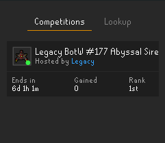
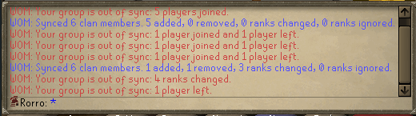
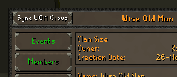

# Wise Old Man

Helps you manage your wiseoldman.net group.

## Features

#### Automation

- Automatically sends name changes of you and your friends to [WOM](https://wiseoldman.net).
- Automatically updates your gains on log out (If you have gained at least 10k xp).

#### Competitions

Competitions panel containing all your ongoing and upcoming competitions with information about each. Time left/Time
until start, gains and your rank are shown here. Right clicking a competition will let you add it to the canvas so
you can view it without opening the side panel.

#### Clan tab options

Right click menu options, on the Clan Chat tab, to import group members and go to the group page
on [WOM](https://wiseoldman.net).

#### Group unsynced notification

Sends a notification on login telling you if your group needs syncing.

#### Sync WOM Group

Adds a "Sync WOM Group" button in the top left corner of your clan settings interface letting you easily sync your
in-game clan with your WOM group with one click.

#### WOM Lookup

Adds a WOM lookup option that lets you look up a player's stats. This only works for people who are tracked on Wise Old
Man.

### Configuration

##### Group

- Import Group option: Adds the Import Group option to the clan chat tab.
- Browse Group option: Adds the Browse Group option to the clan chat tab.
- Sync Clan Button: Adds a "Sync WOM Group" button to the clan settings interface.
- Always included: Comma separated usernames to always include in the sync, even if they are not in your in-game clan.
- Group id: This is the group id that can be found on the group page on
  WOM. [Example.](https://wiseoldman.net/groups/139)
- Verification code: This is the verification code you get when you create the group, which is used to edit the group.

##### Lookup

- Player option: Adds the WOM Lookup option when right clicking a player.
- Menu option: Adds the WOM Lookup option in the right click menu.
- Virtual levels: Show virtual levels in the sidebar look up.
- Relative time: Show the "Last updated" time in teh lookup tab relatively.

#### Competitions

- Login info: Show ongoing competition notification in the chat box on log in.
- Competition notifications: Send notifications when competitions are about to start or end.
- Auto add to canvas: Automatically add competitions to canvas.

#### Event codeword

- Display codeword: displays the codeword on the screen.
- Codeword: The codeword that will be displayed on the screen.
- Timestamp: Enables timestamp alongside the codeword.

### Support & Suggestions

If you have suggestions or need support, feel free to join our Discord server [here.](https://wiseoldman.net/discord)

